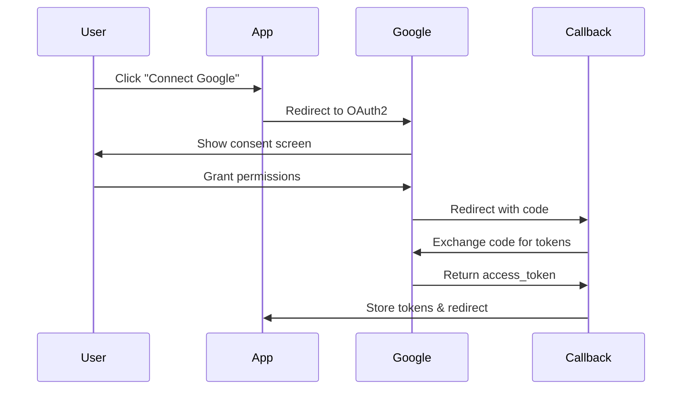

# 🔐 Google OAuth2 Setup Guide

Hướng dẫn cài đặt Google OAuth2 cho MLT Script AI Platform.

## 📋 **Bước 1: Tạo Google Cloud Project**

1. Truy cập [Google Cloud Console](https://console.cloud.google.com/)
2. Tạo project mới hoặc chọn project có sẵn
3. Enable các API cần thiết:
   - **Google Drive API**
   - **Google Sheets API**
   - **Google Identity Services**

## 🔑 **Bước 2: Tạo OAuth2 Credentials**

1. Vào **APIs & Services** > **Credentials**
2. Click **Create Credentials** > **OAuth 2.0 Client IDs**
3. Chọn **Web application**
4. Điền thông tin:

### **Authorized JavaScript origins:**
```
http://localhost:3000
https://your-domain.com (production)
```

### **Authorized redirect URIs:**
```
http://localhost:3000/oauth2/callback
https://your-domain.com/oauth2/callback (production)
```

## ⚙️ **Bước 3: Cấu hình Environment Variables**

Tạo file `.env` trong thư mục gốc:

```bash
# Google OAuth2 Configuration
REACT_APP_GOOGLE_CLIENT_ID=your_client_id_here
REACT_APP_GOOGLE_CLIENT_SECRET=your_client_secret_here

# OAuth2 Redirect URI
REACT_APP_OAUTH2_REDIRECT_URI=http://localhost:3000/oauth2/callback

# Development settings
NODE_ENV=development
REACT_APP_ENV=development
```

## 🚀 **Bước 4: Test OAuth2 Flow**

1. **Start development server:**
   ```bash
   npm start
   ```

2. **Click "Kết nối với Google"** trên trang chủ
3. **Đăng nhập Google** và cấp quyền
4. **Redirect về** `/oauth2/callback`
5. **Xem kết quả** trong console và localStorage

## 🔍 **Bước 5: Debug và Troubleshooting**

### **Common Issues:**

1. **"redirect_uri_mismatch"**
   - Kiểm tra redirect URI trong Google Cloud Console
   - Đảm bảo khớp chính xác với `REACT_APP_OAUTH2_REDIRECT_URI`

2. **"invalid_client"**
   - Kiểm tra CLIENT_ID và CLIENT_SECRET
   - Đảm bảo đã enable đúng APIs

3. **"access_denied"**
   - User từ chối cấp quyền
   - Kiểm tra scope permissions

### **Console Logs:**
```javascript
// Check OAuth2 callback
console.log('OAuth2 Callback received:', { code, state });

// Check token exchange
console.log('Token exchange result:', tokenData);

// Check user info
console.log('User info:', userInfo);
```

## 📱 **Bước 6: Production Deployment**

### **Update Google Cloud Console:**
1. Thêm production domain vào **Authorized JavaScript origins**
2. Thêm production callback URL vào **Authorized redirect URIs**
3. Update environment variables

### **Environment Variables (Production):**
```bash
REACT_APP_GOOGLE_CLIENT_ID=your_production_client_id
REACT_APP_OAUTH2_REDIRECT_URI=https://your-domain.com/oauth2/callback
NODE_ENV=production
```

## 🛡️ **Security Best Practices**

1. **Never expose CLIENT_SECRET** in frontend code
2. **Use HTTPS** in production
3. **Validate state parameter** to prevent CSRF attacks
4. **Store tokens securely** (localStorage for demo, httpOnly cookies for production)
5. **Implement token refresh** logic
6. **Add logout functionality** to clear tokens

## 🔄 **OAuth2 Flow Diagram**



## 📚 **Additional Resources**

- [Google OAuth2 Documentation](https://developers.google.com/identity/protocols/oauth2)
- [Google Identity Services](https://developers.google.com/identity/gsi/web)
- [Google Drive API](https://developers.google.com/drive/api)
- [Google Sheets API](https://developers.google.com/sheets/api)

## 🆘 **Need Help?**

Nếu gặp vấn đề, kiểm tra:
1. Console logs trong browser
2. Network tab trong DevTools
3. Google Cloud Console logs
4. Environment variables configuration

---

**Lưu ý:** Đảm bảo không commit file `.env` chứa thông tin nhạy cảm vào Git repository!
